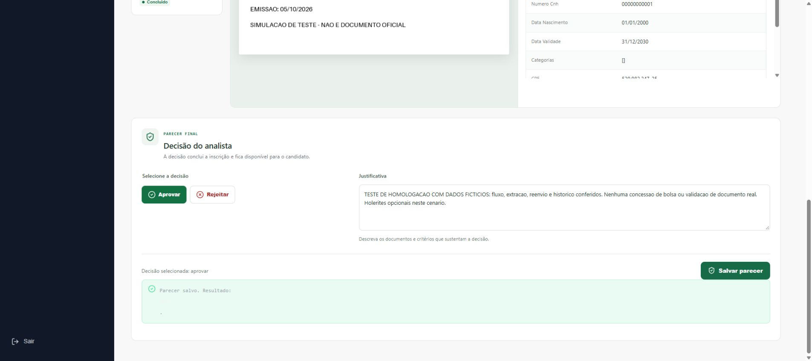
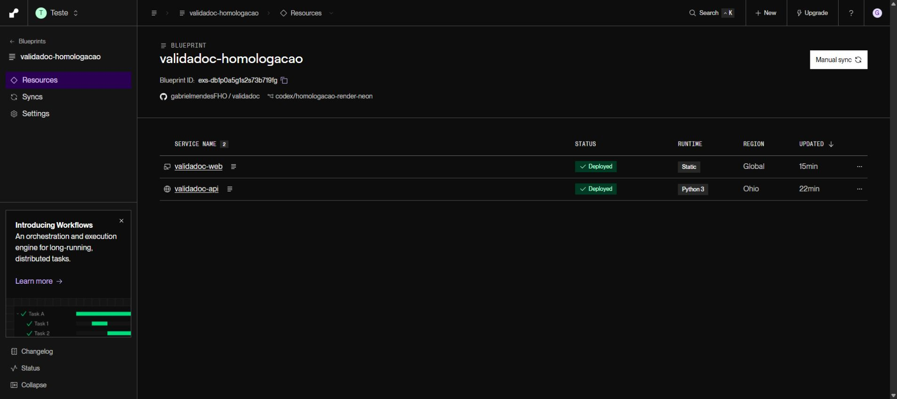

# Validação da homologação Render + Neon — 05/10/2026

## Estado

Configuração e PostgreSQL implementados. Projeto Neon **ValidaDoc-Homologacao** criado no plano Free em Ohio, PostgreSQL 18. Conexão agrupada com TLS guardada em arquivo ignorado pelo Git; segredos não constam deste relatório. `init-db` executado duas vezes, seguido de `check-db`: schema compatível, sem duplicação do processo. Nenhum pack pessoal ou banco MariaDB foi copiado.

**Site e API publicados para testes do grupo.** [Site](https://validadoc-web.onrender.com) e [saúde da API](https://validadoc-api.onrender.com/health) verificados. API Python Free em Ohio e site Static; Neon Free PostgreSQL 18. Branch `codex/homologacao-render-neon` enviada com autorização explícita, sem merge na main. API no commit `0828b1c`, site no `4d562ab` (correção de reenvio); commit posterior registra evidências/documentação, sem alteração do código publicado. Os serviços existentes de outro projeto não foram alterados. Quatro contas fictícias com senhas fortes próprias estão em arquivo local ignorado; senhas não são publicadas.

## Evidências locais

| Verificação | Resultado |
|---|---|
| Baseline Windows | 95 testes do backend passaram |
| Backend final, Python 3.14.3/Linux + PostgreSQL 17 dedicado | 123 testes passaram; 3 avisos de dependências |
| Novos testes de banco | 13 passaram, com schemas descartáveis exclusivos |
| Normalização da URL | `postgres://`/`postgresql://` → Psycopg 3, preservando TLS/query/credenciais |
| Repetição do provisionamento | Preserva processo, documentos, inscrições, perfil e hash de usuário existente |
| PostgreSQL | Persistência de enum/binário Fernet e atualização de atividade confirmadas |
| Configuração e SMTP | Chaves/CORS inválidos recusados, erros sanitizados, SMTP desativado não acessa rede |
| `/health` | Testes 200 com banco e 503 sanitizado sem banco |
| Frontend | 3 testes Node, lint e build com URL HTTPS passaram; build sem URL recusado |
| Bundle | Sem `127.0.0.1:8000`, URL PostgreSQL ou `GEMINI_API_KEY` |
| Dependências frontend | Axios e brace-expansion atualizados dentro das faixas atuais; `npm audit` sem vulnerabilidades |
| Blueprint | Validado com JSON Schema oficial obtido em `https://render.com/schema/render.yaml.json` |

As regressões de configuração foram observadas falhando antes da validação. O novo `/health` inicialmente respondeu 404. A comparação do schema falhou na repetição por aliases PostgreSQL e foi corrigida; divergência real de coluna permanece bloqueada. Uma execução isolada com o default MySQL anterior reproduziu erro de sintaxe PostgreSQL em `ON UPDATE`, seguida da suíte com o default portável passando. A mutação não alterou arquivos do produto.

O Controle de Aplicativo do Windows bloqueou a DLL Psycopg 3.3.6. Os testes e o provisionamento Neon foram executados no Docker/Linux sem desativar proteções. O teste PostgreSQL usa apenas banco dedicado `validadoc_test_*`; a conexão publicada não é usada em fixtures que removem schemas.

## Capacidade e memória

O painel Neon usado na criação mostra **0,5 GB**; não assumir 1 GB anunciado sem confirmar na conta. A estimativa histórica de sete arquivos/10.043.489 bytes projeta aproximadamente 96 MB Fernet para 50 documentos, antes de overhead/reenvios. A amostra completa de 50 ainda não foi medida.

Nesta execução foram encontrados seis arquivos de formatos aceitos no diretório controlado. Processamento sequencial local, sem rede e com container limitado a 512 MB: pico de **363,8 MiB RSS** no subprocesso isolado e **491,6 MiB RSS** repetindo o processamento depois de importar a API completa; imagem maior 4032×3024 pixels. Os seis arquivos somaram **8.298.042 bytes**. Não houve envio desses documentos ao Neon/Gemini nessa medição. A margem é pequena e a medição ainda não cobre envio ao provedor, escrita criptografada no banco ou uploads simultâneos: não considerar a hospedagem estável até esses testes.

O build mantém aviso de bundle de aproximadamente 742 kB; divisão de código pode ser feita depois. O SMTP fica desativado; mensagens de boas-vindas não são enviadas.

## Rodada remota pelo navegador

| Caso | Resultado observado |
|---|---|
| Login candidato | Acesso à jornada da própria inscrição |
| KYC CNH fictícia | Extração de nome/CPF, preenchimento e avanço à família |
| Grupo familiar | Familiar fictício salvo e preservado após refresh direto em `/familia` |
| Duplicidade | Mesmo binário do titular recusado para documento do familiar |
| Indisponibilidade Gemini | Modelo principal respondeu 503; fallback concluiu KYC. Outra tentativa recebeu 503/504 e mostrou erro recuperável |
| Reenvio do mesmo arquivo | Falha reproduzida: selecionar o mesmo arquivo não disparava evento. Seletor corrigido no dashboard e KYC; navegador confirmou limpeza e novo envio efetivo |
| Identidade divergente | CNH fictícia com CPF do titular rejeitada para o familiar |
| Versão corrigida | CNH fictícia com CPF do familiar extraída e aceita |
| Conclusão documental | Inscrição avançou para `PRONTO_AUDITORIA` e apareceu na fila |
| Analista | Login, dashboard, fila e auditoria carregaram |
| Refresh `/auditoria/1` | Tela e documento carregaram normalmente |
| Histórico | Quatro envios preservados: titular concluído, erro de extração, CPF rejeitado e familiar corrigido |
| Original criptografado | Documento exibido na auditoria após descriptografia pelo backend |
| Conferência automática | Alertas de renda/holerite ausentes na amostra, exigindo revisão manual |
| Parecer fictício | Salvo como teste; candidato viu `CONCLUIDO`, resultado e justificativa |
| Candidato em auditoria | Interface mostra ação restrita a ANALISTA/ADMIN; não retorna documentos |
| API com outro candidato | 403 para KYC, checklist, membros, detalhe, fila, dashboard interno e arquivo da inscrição alheia; própria inscrição 200; arquivo sem login 401 |
| CORS | Origem real do site aceita; origem não autorizada recebe 400 no preflight |
| Reinício Render | Solicitado durante envio; a análise concluiu antes da interrupção efetiva, e os registros/arquivos persistiram. Não reproduziu perda de tarefa |
| Hibernação | Após mais de 16 minutos sem tráfego, primeiro login ADMIN concluiu sem repetir envio; acesso observado em até 71 segundos. Render registrou novo processo às 09:29:51 BRT e `/health` retornou 200 novamente |

O bundle remoto `/assets/index-CvbQq2jM.js` foi baixado e conferido: URL HTTPS correta; sem API local, conexão PostgreSQL, chave Gemini, JWT, Fernet ou senhas privadas.

Regressão de reenvio observada no navegador antes da correção e verificada após publicar `4d562ab`; lint, três testes Node e build passaram. O arquivo do input é capturado antes de limpar o seletor, permitindo selecionar novamente o mesmo binário. Erros 503/504 são indisponibilidade do provedor; a rodada não revelou erro de autenticação da chave. Não comprova cota nem disponibilidade contínua do Gemini.

Os documentos são imagens sintéticas com a indicação **DOCUMENTO FICTÍCIO / SEM VALIDADE**. Esta rodada comprova integração, extração e fluxo; não comprova autenticidade forense nem elegibilidade para bolsa. O parecer informa expressamente que nenhuma concessão real foi feita. SMTP permanece desativado, apesar do texto genérico de e-mail presente na jornada.

## Backup e memória da API completa

Backup do Neon pela conexão direta com TLS, usando `pg_dump` 18, restaurado sem `--clean` em banco local PostgreSQL 18 novo e vazio. Conferidos 4 usuários, 2 inscrições, 1 membro, 4 documentos/binários e 4 análises. A chave Fernet privada descriptografou o primeiro documento restaurado, com bytes idênticos à fixture original. Dump/credenciais permanecem ignorados, fora do Git; a chave está separada do dump. Não altera o Neon nem o MariaDB local.

Num clone local do backup, a API inteira rodou em container de 512 MiB. Um upload sintético JPEG de 4032×3024 (463.472 bytes) passou pelo endpoint real, criptografia, PostgreSQL e extração: HTTP 202, pico amostrado de 273,4 MiB em 24 medições Docker, `OOMKilled=false`. A IA terminou em `ERRO_EXTRACAO` por indisponibilidade. Esta medição não demonstra sucesso da IA nesse arquivo nem estabilidade para imagens pessoais/concorrência; a amostra controlada anterior atingiu 491,6 MiB no processamento local.

Interrupção efetiva verificada no clone local: processo da API encerrado imediatamente após HTTP 202 do documento fictício #6; após 125 segundos e novo startup, o KYC marcou `ERRO_EXTRACAO` por timeout. Reenvio do mesmo arquivo retornou HTTP 202, criou #7 e preservou #6. Não há retomada automática. O reinício remoto observado continuou inconclusivo quanto à perda de tarefa.

## Limitações e próximos testes

- Reproduzir perda efetiva de tarefa no Render: o reinício observado permitiu concluir a extração. A recuperação por timeout de 120 segundos está coberta pelas regressões automatizadas, mas a interrupção remota permaneceu inconclusiva.
- Medir os 50 documentos quando estiverem disponíveis, uso de armazenamento e uploads simultâneos. Banco medido nesta rodada: 8.552.448 bytes; quatro binários Fernet somaram 212.236 bytes, incluindo os reenvios.
- Não há fila persistente/retomada automática; se o processo parar durante a IA, conferir a tela e reenviar após o timeout.
- Quotas do Gemini são separadas; o provedor apresentou indisponibilidade intermitente durante os testes.

Guia operacional e backup em `docs/HOMOLOGACAO.md`.

## Revisão e regressões finais

As três constatações foram reproduzidas com testes falhando e corrigidas na mesma rodada: candidato provisionado agora usa nome provisório reconhecido e aceita identidade fictícia, preenche nome/CPF e avança KYC; KYC aplica o mesmo timeout de 120 segundos do checklist e libera reenvio sem alterar histórico ou processo recente; schema recusa defaults obrigatórios ausentes e IDs sem geração. A suíte final passou com 123 testes, incluindo 13 de configuração/provisionamento PostgreSQL e dois cenários de interrupção/atividade recente no KYC. `check-db` no Neon passou novamente após a checagem mais completa.

## Decisões de execução

- Worktree nativo a partir de HEAD para preservar a versão local em execução; integração posterior permanece necessária.
- Ledger preservado como registro local. A autorização posterior permitiu os commits e o push da branch de homologação.
- PostgreSQL testado/administrado em Linux devido ao bloqueio da DLL Windows; Windows precisa desse ambiente Docker para os comandos Neon.
- Apenas atualizações compatíveis de Axios/brace-expansion para eliminar avisos reais do audit; verificados lint/build e a rodada remota pelo navegador.
